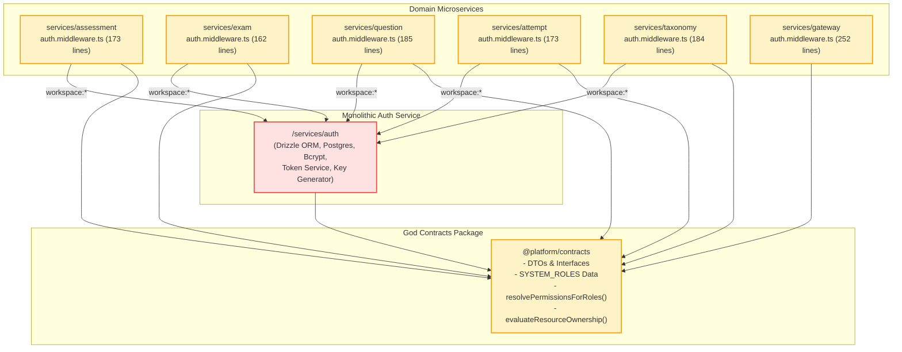
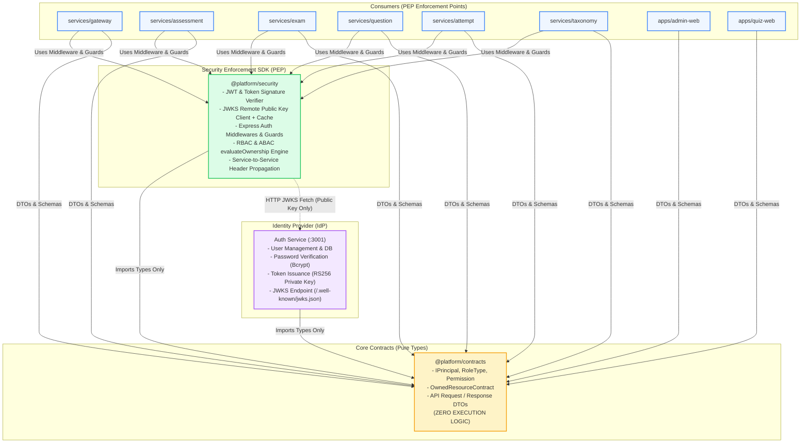
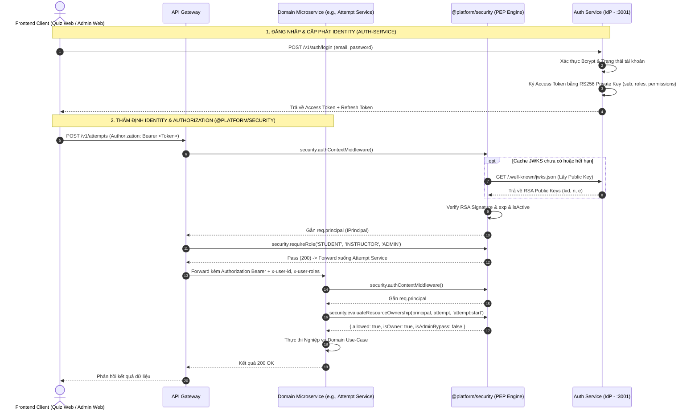
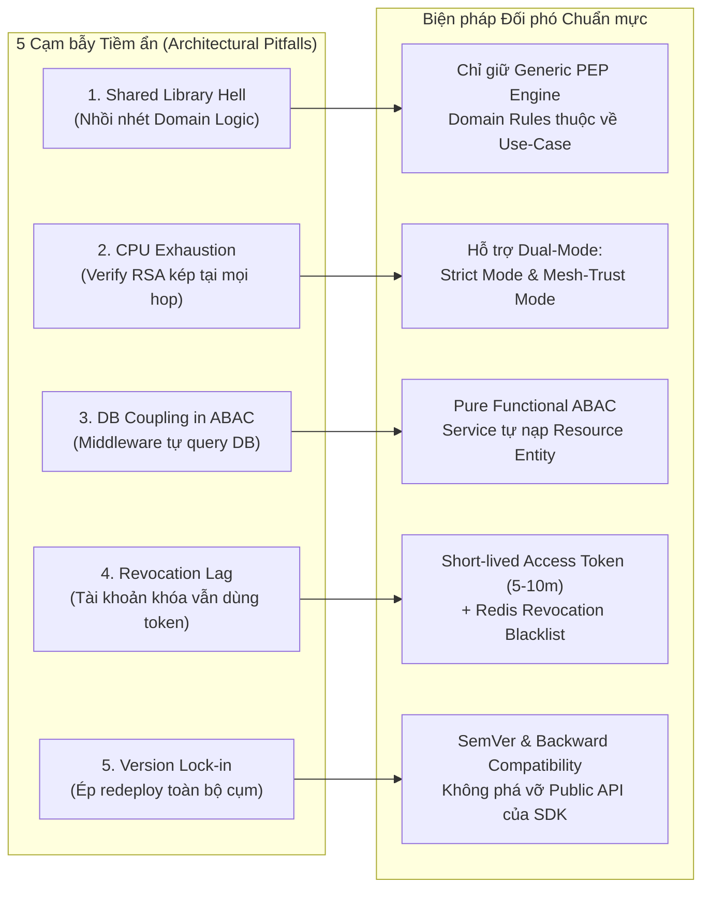
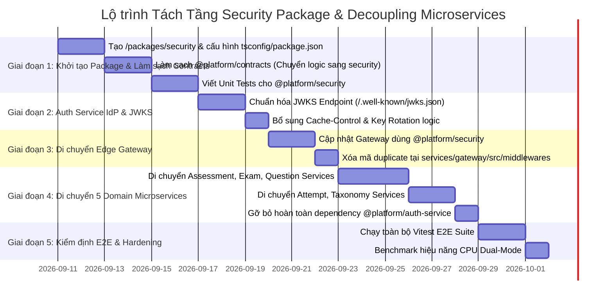

# BÁO CÁO AUDIT KIẾN TRÚC PHÂN QUYỀN & GIẢI PHÁP TÁCH TẦNG SECURITY PACKAGE
## (DECOUPLING AUTHORIZATION: SERVICE → @PLATFORM/SECURITY → @PLATFORM/CONTRACTS)

---

## 1. TỔNG QUAN & BỐI CẢNH AUDIT (EXECUTIVE SUMMARY)

### 1.1. Vấn đề Đặt ra (Problem Statement)
Trong quá trình mở rộng hệ sinh thái Microservices của nền tảng thi trắc nghiệm trực tuyến (gồm 6 dịch vụ độc lập: *Auth, Attempt, Exam, Assessment, Question, Taxonomy* và *Edge Gateway*), hệ thống đang gặp phải hiện tượng **Coupling nghiêm trọng** trong khâu xác thực danh tính (**Authentication**) và kiểm soát phân quyền (**Authorization**):

1. **Gói Contracts bị biến dạng thành "God Package"**: Gói `@platform/contracts` vốn phải là nơi định nghĩa thuần túy các Type Definitions, Interfaces và DTOs nhưng hiện đang chứa cả logic nghiệp vụ phân quyền (`evaluateResourceOwnership`, `evaluateOwnership`, `resolvePermissionsForRoles`, `SYSTEM_ROLES`).
2. **Kéo ngược Dependency vi phạm Microservice Autonomy**: Các domain services độc lập (`assessment`, `exam`, `question`, `attempt`, `taxonomy`) đang khai báo phụ thuộc trực tiếp vào `@platform/auth-service: "workspace:*"` chỉ để mượn cặp khóa `getDefaultRsaKeyPair()` nhằm giải mã chữ ký JWT RS256.
3. **Trùng lặp mã nguồn (Code Duplication & Drift)**: Mỗi domain microservice đang sao chép lại một file `auth.middleware.ts` dài ~180 dòng với toàn bộ logic giải mã base64url, kiểm tra crypto RS256/HS256, đọc header fallback, và kiểm tra trạng thái kích hoạt tài khoản.

### 1.2. Giải pháp Kiến trúc Đích (Target Architecture)
Tái cấu trúc luồng định danh và phân quyền theo mô hình phân tách 3 tầng độc lập, bảo đảm nguyên tắc **Single Responsibility Principle (SRP)** và **Dependency Inversion Principle (DIP)**:

$$\text{Domain Services / Gateway} \longrightarrow \mathbf{@platform/security} \longrightarrow \mathbf{@platform/contracts}$$

$$\uparrow$$

$$\mathbf{Auth\text{ }Service\text{ (Identity Provider - IdP)}}$$

- **Auth Service (IdP)**: Chỉ tập trung tạo, quản lý vòng đời tài khoản, băm mật khẩu, cấp phát Token Pair (RS256 Private Key) và công bố Public Key qua chuẩn JWKS (`/.well-known/jwks.json`).
- **@platform/security (PEP SDK)**: Thư viện độc lập kiểm tra danh tính (JWT Validator, JWKS Key Resolver, Fallback Handler, RBAC Guards, ABAC Resource Ownership Evaluator).
- **@platform/contracts (Pure Types)**: Gói hợp đồng thuần túy (Zero-Logic) chứa `Principal`, `RoleType`, `Permission`, `OwnedResource`, DTOs và Constants.

---

## 2. PHÂN TÍCH HIỆN TRẠNG & CÁC LỖ HỔNG COUPLING (CURRENT STATE RCA)

### 2.1. Bản đồ Phụ thuộc Hiện tại (Current High-Coupling Architecture)



### 2.2. Bóc tách 5 Anti-Patterns Cốt lõi trên Codebase

#### ❌ Anti-Pattern 1: Domain Services kéo toàn bộ mã nguồn của Identity Provider
Trong file `package.json` của từng service (`services/assessment/package.json`, `services/question/package.json`, v.v.):
```json
"dependencies": {
  "@platform/auth-service": "workspace:*",
  "@platform/contracts": "workspace:*",
  "drizzle-orm": "^0.45.2",
  "express": "^5.2.1",
  "postgres": "^3.4.9"
}
```
Và trong từng file `auth.middleware.ts`:
```typescript
import { getDefaultRsaKeyPair } from '@platform/auth-service';
```
- **Hệ quả**: Mặc dù chỉ cần hàm lấy RSA Public Key, các microservice phải import `@platform/auth-service`. Điều này kéo theo toàn bộ transient dependencies của Auth Service (như mã kết nối database Drizzle của auth, Bcrypt, Token storage, v.v.), phá vỡ tính độc lập khi đóng gói Docker Container và làm phình kích thước image.

#### ❌ Anti-Pattern 2: Logic nghiệp vụ thực thi nằm lẫn trong `@platform/contracts`
Trong file `/packages/contracts/src/auth/ownership.ts` và `/packages/contracts/src/auth/principal.ts`:
```typescript
// /packages/contracts/src/auth/ownership.ts
export function evaluateResourceOwnership(
  principal: Principal,
  resource: OwnedResource,
  requiredPermission?: string,
  manageAllPermission?: string
): OwnershipEvaluationResult { ... }

// /packages/contracts/src/auth/principal.ts
export const SYSTEM_ROLES: Record<RoleType, Role> = { ... };
export function resolvePermissionsForRoles(roles: readonly string[]): readonly string[] { ... }
```
- **Hệ quả**: `@platform/contracts` không còn là "Giao ước kiểu dữ liệu" (Type Contracts) thuần túy. Khi logic phân quyền hoặc thuật toán wildcard permission (`:*`) cần thay đổi, lập trình viên phải sửa đổi gói contracts, buộc tất cả các frontend và backend services phải re-compile/re-deploy.

#### ❌ Anti-Pattern 3: Trùng lặp mã xác thực JWT tại 6 nơi khác nhau (Copy-Paste Middlewares)
- `services/assessment/src/presentation/middlewares/auth.middleware.ts` (173 lines)
- `services/question/src/presentation/middlewares/auth.middleware.ts` (185 lines)
- `services/exam/src/presentation/middlewares/auth.middleware.ts` (162 lines)
- `services/attempt/src/presentation/middlewares/auth.middleware.ts` (173 lines)
- `services/taxonomy/src/presentation/middlewares/auth.middleware.ts` (184 lines)
- `services/gateway/src/middlewares/auth.middleware.ts` (252 lines)

Các hàm `verifyJwtSignature`, `base64UrlDecode`, parse payload, verify signature RS256/HS256, đọc header `x-user-id`, `x-user-roles` đều được viết thủ công giống hệt nhau.
- **Hệ quả**: Bất kỳ bản vá bảo mật nào (ví dụ: vá lỗi thuật toán JWT `none`, xử lý clock skew tolerance, thêm hỗ trợ JWKS caching) đều đòi hỏi phải chỉnh sửa thủ công ở 6 repositories/services khác nhau. Nguy cơ "Configuration Drift" dẫn đến việc một service chấp nhận token trong khi service khác từ chối.

#### ❌ Anti-Pattern 4: Vi phạm nguyên tắc Zero-Trust & Policy Enforcement Point (PEP)
- Ở kiến trúc hiện tại, API Gateway xác thực một phần, nhưng các downstream services lại tự giải mã token theo cách phân mảnh.
- Không có một SDK bảo mật chuẩn hóa đóng gói sẵn các Guards: `requireAuth()`, `requireRole('INSTRUCTOR')`, `requirePermission('quiz:create')`, `guardOwnership()`.

#### ❌ Anti-Pattern 5: Thiếu cơ chế Dynamic Key Discovery (JWKS) chuẩn hóa
- Việc chia sẻ RSA key phụ thuộc vào việc gọi trực tiếp hàm nội bộ của Auth Service hoặc đọc biến môi trường `JWT_PUBLIC_KEY`.
- Khi Auth Service muốn thực hiện **Key Rotation** (xoay khóa định kỳ nhằm tuân thủ chuẩn ISO 27001 / PCI-DSS), các microservice không thể tự động nhận diện khóa mới nếu không khởi động lại hoặc sửa code.

---

## 3. KIẾN TRÚC ĐÍCH ĐỀ XUẤT: PHÂN TÁCH 3 TẦNG (DECOUPLED TARGET ARCHITECTURE)

### 3.1. Sơ đồ Cấu trúc Phụ thuộc Đích (Target Dependency Graph)



### 3.2. Sơ đồ Luồng Tương tác Thực thi Xác thực & Phân quyền (Sequence Flow)



---

## 4. THIẾT KẾ CHI TIẾT GÓI `@PLATFORM/SECURITY` & CÁC THÀNH PHẦN

### 4.1. Cấu trúc Thư mục Gói `@platform/security`

```
/packages/security
├── package.json
├── tsconfig.json
├── README.md
├── src
│   ├── index.ts                         # Entry-point xuất toàn bộ guards & evaluators
│   ├── types.ts                         # Kiểu dữ liệu nội bộ của Security
│   ├── token
│   │   ├── jwt-verifier.ts              # Engine giải mã & kiểm tra chữ ký RS256/HS256
│   │   ├── jwks-client.ts               # Remote JWKS fetcher kèm bộ nhớ đệm (LRU/TTL cache)
│   │   └── base64url.ts                 # Trình xử lý Base64URL decoding chuẩn RFC 7515
│   ├── authorization
│   │   ├── rbac.ts                      # Role & Wildcard Permission Matcher
│   │   ├── abac-ownership.ts            # Resource Ownership Evaluator (Chủ sở hữu & Admin Bypass)
│   │   └── system-roles.ts              # Bảng định nghĩa quyền hệ thống mặc định
│   └── middlewares
│       ├── express-auth.middleware.ts   # Middleware trích xuất req.principal cho Express
│       ├── express-guards.ts            # requireAuth, requireRole, requirePermission, requireAuthor
│       └── header-propagation.ts        # Helper tiêm các header định danh bảo mật downstream
└── tests
    ├── jwt-verifier.spec.ts             # Kiểm thử giải mã & chống làm giả chữ ký token
    ├── jwks-client.spec.ts              # Kiểm thử tải và cache public key từ xa
    ├── rbac.spec.ts                     # Kiểm thử so khớp quyền chi tiết & wildcard
    └── abac-ownership.spec.ts           # Kiểm thử quyền sở hữu tài nguyên & admin bypass
```

### 4.2. Đặc tả Chi tiết Các Module Cốt lõi

#### A. Token Verification & JWKS Key Resolver (`src/token/`)
- Hỗ trợ giải mã chữ ký **RS256** bất đối xứng:
  - Ưu tiên đọc biến môi trường `JWT_PUBLIC_KEY` nếu được cấu hình tĩnh.
  - Tự động fetch từ xa qua endpoint `AUTH_JWKS_URL` (mặc định: `http://127.0.0.1:3001/.well-known/jwks.json`) với cơ chế in-memory TTL caching (5 phút) và timeout (2000ms), ngăn chặn việc nghẽn mạng.
- Hỗ trợ giải mã **HS256** đối xứng cho môi trường thử nghiệm và phát triển cục bộ (`JWT_SECRET`).
- Kiểm tra tính hợp lệ về thời gian (`exp`, `nbf`) với 10 giây clock-skew tolerance.
- Kiểm tra trạng thái tài khoản `isActive === false` ngay tại tầng token payload.

#### B. Authorization Engine (`src/authorization/`)
- **RBAC Engine (`rbac.ts`)**:
  - `hasPermission(permissions: readonly string[], required: string): boolean`: Kiểm tra phân quyền chính xác, hỗ trợ wildcard toàn phần (`*`) và wildcard tiền tố (`quiz:*`, `attempt:*`).
  - `resolvePermissionsForRoles(roles: readonly string[]): readonly string[]`: Ánh xạ danh sách vai trò thành tập quyền hạn hiệu lực.
- **ABAC Resource Ownership Evaluator (`abac-ownership.ts`)**:
  - `evaluateResourceOwnership(principal, resource, requiredPermission?, manageAllPermission?)`: Thẩm định xem người dùng có phải tác giả/chủ sở hữu (`userId`, `authorId`, `ownerId`, `instructorId`) hoặc có quyền quản trị bypass (`ADMIN`, `SUPER_ADMIN`, `*`).

#### C. Express Middlewares & Guards (`src/middlewares/`)
- `authContextMiddleware(options?)`: Trích xuất token từ header `Authorization: Bearer <token>`, giải mã và gán `req.principal`. Nếu không có Bearer token, hỗ trợ an toàn fallback sang headers `x-user-id`, `x-user-roles` (chỉ khi được bật cấu hình cho môi trường test/internal).
- `requireAuth()`: Trả về `401 Unauthorized` nếu `req.principal` không tồn tại.
- `requireRole(...roles)`: Trả về `403 Forbidden` nếu người dùng không sở hữu ít nhất một trong các vai trò chỉ định.
- `requirePermission(...permissions)`: Trả về `403 Forbidden` nếu thiếu quyền hạn yêu cầu.
- `requireOwnership(getResourceCallback, requiredPerm?)`: Guard tự động lấy tài nguyên và đánh giá quyền sở hữu trước khi vào controller.

---

## 5. SO SÁNH TRƯỚC & SAU KHI CẢI TỔ (BEFORE VS. AFTER MATRIX)

| Tiêu chí Đánh giá | Kiến trúc Cũ (High-Coupling) | Kiến trúc Mới (@platform/security) | Lợi ích Đạt được |
| :--- | :--- | :--- | :--- |
| **Sự Phụ thuộc Domain Service** | Phụ thuộc `@platform/auth-service` (Drizzle, Bcrypt, DB, Use cases). | Chỉ phụ thuộc `@platform/security` và `@platform/contracts`. | **Zero Coupling** tới mã nguồn và database của Auth Service. |
| **Gói `@platform/contracts`** | Chứa logic thực thi (`evaluateResourceOwnership`, `resolvePermissionsForRoles`). | 100% Pure Types, Interfaces & Schemas (Zero Logic). | Đạt chuẩn **Clean Architecture**, không bị re-compile khi đổi logic. |
| **Trùng lặp Mã nguồn (DRY)** | ~1.100 dòng code middleware bị copy-paste qua 6 dịch vụ. | 0 dòng lặp lại. Mọi service chỉ cần 1 dòng `app.use(authContextMiddleware)`. | Giảm **85% mã nguồn boilerplate**, loại trừ nguy cơ lệch code (Drift). |
| **Key Rotation & JWKS** | Hardcode public key hoặc gọi hàm nội bộ của Auth Service. | Tự động lấy public key qua HTTP JWKS với cơ chế TTL cache an toàn. | Hỗ trợ **Zero-Downtime Key Rotation** chuẩn doanh nghiệp. |
| **Kích thước Container Image** | Image của Question, Exam, Attempt bị đội dung lượng do kéo dependency Auth. | Image siêu gọn, không mang theo ORM/Bcrypt không cần thiết. | **Tối ưu Cold Start** và tiết kiệm dung lượng lưu trữ Cloud Registry. |
| **Bảo mật & Cập nhật Bản vá** | Phải cập nhật và test 6 file middleware riêng biệt khi có lỗi bảo mật. | Chỉ cần cập nhật phiên bản gói `@platform/security`. | Đơn giản hóa quy trình **Security Patching & Compliance**. |
| **Khả năng Kiểm thử Độc lập** | Domain tests khó mock do phụ thuộc gián tiếp vào Auth internals. | Dễ dàng mock `Principal` hoặc dùng InMemory Key Provider trong tests. | Tăng tốc độ chạy Unit Tests và độ ổn định của CI/CD pipeline. |

---

## 6. ĐÁNH GIÁ ĐỘC LẬP & CÁC BIỆN PHÁP TRÁNH CẠM BẪY KIẾN TRÚC (PITFALL PREVENTION & GOVERNANCE)

Khi triển khai mô hình `@platform/security`, nếu không có các nguyên tắc thiết kế nghiêm ngặt, hệ thống rất dễ rơi từ cạm bẫy này sang cạm bẫy khác (từ "Monolith Service Coupling" chuyển thành "Shared Library Hell"). Dưới đây là phân tích 5 cạm bẫy tiềm ẩn nguy hiểm nhất và các biện pháp đối phó cụ thể:



---

### ⚠️ Cạm bẫy 1: Biến `@platform/security` thành "Bãi rác Logic" (Shared Library Hell)
* **Nguy cơ**: Nhiều đội ngũ khi tạo SDK bảo mật dùng chung thường có xu hướng nhét **tất cả** mọi quy tắc kiểm tra vào package này (từ kiểm tra token, kiểm tra role, đến kiểm tra trạng thái bài thi, kiểm tra hạn nộp bài, kiểm tra quota lớp học, rate-limit nghiệp vụ, audit logging).
* **Hậu quả**: Khi nghiệp vụ của một service thay đổi (ví dụ: `attempt-service` đổi quy tắc nộp bài quá hạn), ta lại phải sửa `@platform/security`, bump version và ép tất cả 5 service còn lại phải cập nhật và re-deploy theo.
* **Biện pháp Phòng ngừa**:
  1. **Nguyên tắc "Chỉ Generic PEP"**: `@platform/security` **CHỈ LÀM PHẦN GENERIC**:
     - Xác thực danh tính (`Identity & Signature Verification`).
     - Giải mã Token & JWKS Remote Key Caching.
     - Kiểm tra phân quyền tĩnh (RBAC Role/Permission Matching).
     - Hàm thuần túy đánh giá quyền sở hữu: `evaluateResourceOwnership(resourceOwnerId, principal)`.
  2. **Domain Authorization thuộc về UseCase của từng Service**:
     - Các quy tắc như: *"Bài thi có đang mở không?"*, *"Thí sinh đã nộp bài chưa?"*, *"Câu hỏi đã được duyệt qua quy trình Review chưa?"* là **Domain Rules**, **BẮT BUỘC** nằm trong tầng Application/Domain Use-Case của Service tương ứng, tuyệt đối không đưa vào Security SDK.

---

### ⚠️ Cạm bẫy 2: Cân bằng Trade-off giữa "Zero-Trust" và "Hiệu năng CPU"
* **Nguy cơ**: Trong kiến trúc Microservices phân tán, nếu cả Gateway và từng Domain Service đều chạy thuật toán giải mã và xác thực chữ ký bất đối xứng RSA (`crypto.verify` với public key 2048-bit) trên mỗi request:
  - Request đi qua Gateway: tốn 1 lần verify RSA (CPU Bound).
  - Gateway proxy tới Exam Service: tốn thêm 1 lần verify RSA.
  - Exam Service gọi nội bộ sang Question Service: lại tốn thêm 1 lần verify RSA.
  - Điều này làm tiêu tốn đáng kể chu kỳ CPU của Node.js Event Loop, gây tăng độ trễ (Latency P99) khi có hàng ngàn thí sinh nộp bài cùng lúc.
* **Biện pháp Phòng ngừa (Mô hình Dual-Mode Verification)**:
  `@platform/security` cần hỗ trợ 2 chế độ hoạt động linh hoạt:
  1. **Strict Mode (Zero-Trust Mode)**: Giải mã và verify chữ ký số RSA đầy đủ. Dùng cho:
     - Edge API Gateway nhận request trực tiếp từ Internet.
     - Các service công khai hoặc môi trường mạng không có Gateway bảo vệ.
  2. **Propagated / Mesh-Trust Mode (Tối ưu Hiệu năng)**:
     - Khi request đi qua Gateway nội bộ đã được xác thực, Gateway gắn Header `x-principal` (được serialize và ký nhẹ HMAC hoặc truyền qua mạng nội bộ Private VPC / mTLS).
     - Downstream services tin tưởng `x-principal` mà không cần chạy lại giải mã RSA nặng nề, giảm tải 60-70% CPU cho các domain worker.

---

### ⚠️ Cạm bẫy 3: Phân định Ranh giới ABAC và Tầng Database
* **Nguy cơ**: Thẩm định quyền sở hữu tài nguyên (Resource-Based ABAC) luôn cần biết ai là chủ sở hữu thực sự của bản ghi (ví dụ: `question.authorId` hoặc `attempt.userId`). Sai lầm phổ biến là cố gắng viết Middleware trong Security SDK tự động query Database để lấy record ra rồi check quyền.
* **Hậu quả**: Khiến `@platform/security` bị dính chặt (tight coupling) vào Database Connection, Drizzle ORM Schema, và cấu trúc bảng của từng service.
* **Biện pháp Phòng ngừa (Pure Functional Evaluation)**:
  - Middleware của Security SDK **chỉ trích xuất và bảo đảm tính hợp lệ của `req.principal`**.
  - Việc truy vấn cơ sở dữ liệu để tìm Entity thuộc trách nhiệm của Service Repository / Use-Case.
  - Use-Case sau khi nạp Entity từ DB sẽ gọi hàm thuần túy (Pure Function - Zero Side Effects):
    ```typescript
    import { evaluateResourceOwnership } from '@platform/security';

    // Trong Question Use-Case:
    const question = await this.questionRepo.findById(questionId);
    if (!question) throw new QuestionNotFoundError();

    const evaluation = evaluateResourceOwnership(
      { ownerId: question.authorId },
      principal,
      { requiredPermission: 'question:update', manageAllPermission: 'question:manage_all' }
    );

    if (!evaluation.allowed) {
      throw new ForbiddenDomainError('Bạn không có quyền chỉnh sửa câu hỏi này');
    }
    ```
  - Bằng cách này, Security SDK hoàn toàn không biết DB là PostgreSQL, MongoDB hay In-Memory.

---

### ⚠️ Cạm bẫy 4: Xử lý Vấn đề Token Revocation (Thu hồi tức thì)
* **Nguy cơ**: Với mô hình Stateless JWT kết hợp JWKS Public Key: Nếu một tài khoản bị Admin Khóa (Disabled), Đổi mật khẩu, hoặc Bị lộ token, các microservice dùng Cached Public Key vẫn sẽ tiếp tục chấp nhận Access Token cũ cho đến khi hết hạn (ví dụ: 15 phút), tạo ra "Cửa sổ rủi ro" (Vulnerability Window).
* **Biện pháp Phòng ngừa**:
  1. **Short-lived Access Token**: Đặt thời gian sống của Access Token ngắn (từ 5 đến 10 phút).
  2. **Token Blacklist / Revocation Bloom Filter (Cho thao tác trọng yếu)**:
     - Với các thao tác rủi ro cao (như: đổi điểm thi, xóa câu hỏi, hủy ca thi, rút tiền), Use-Case có thể kiểm tra nhanh một danh sách đen phân tán (Redis Blacklist / Revocation Cache) do Auth Service đồng bộ khi có sự kiện Logout/Revoke.
  3. **Refresh Token Rotation (RTR)**: Duy trì cơ chế phát hiện tái sử dụng Token Family đã xây dựng tại Auth-Service để vô hiệu hóa toàn bộ chuỗi token ngay lập tức khi phát hiện xâm nhập.

---

### ⚠️ Cạm bẫy 5: Quản trị Phiên bản & Tránh Khóa Chặt Phiên bản (SDK Versioning & SemVer)
* **Nguy cơ**: Khi Security SDK thay đổi interface hoặc bổ sung tính năng mới mà không tuân thủ Semantic Versioning, các service sẽ gặp lỗi biên dịch (Compilation Breakage) hoặc buộc phải đồng loạt nâng cấp cùng lúc.
* **Biện pháp Phòng ngừa**:
  1. **Tuân thủ Strict Semantic Versioning (SemVer)**: 
     - Mọi thay đổi trong `@platform/security` không được làm thay đổi cấu trúc của các hàm cốt lõi (`authContextMiddleware`, `evaluateResourceOwnership`).
  2. **Backward Compatibility**: Luôn giữ tương thích ngược với các Header định danh cũ (`x-user-id`, `x-user-roles`) để không làm gián đoạn các kịch bản kiểm thử E2E và các phiên bản service cũ trong quá trình Rolling Deployment.

---

## 7. LỘ TRÌNH TRIỂN KHAI VÀ DANH MỤC TASK CHI TIẾT (ROADMAP & ACTIONABLE TASKS)

### 7.1. Lộ trình Triển khai 5 Giai đoạn (Gantt Chart)



---

### 7.2. Bảng Danh mục Task Chi tiết (Work Breakdown Structure - WBS)

| Task ID | Hạng mục công việc (Task Name) | Target Files | Đầu vào / Hành động cụ thể | Tiêu chí Hoàn thành (DOD) & Lệnh Kiểm tra |
| :--- | :--- | :--- | :--- | :--- |
| **SEC-101** | Khởi tạo thư mục và cấu hình `@platform/security` | `/packages/security/package.json`, `tsconfig.json`, `src/index.ts` | - Tạo workspace package mới trong pnpm monorepo.<br/>- Khai báo export ESM module và types. | `pnpm --filter @platform/security build` thành công, không lỗi TypeScript. |
| **SEC-102** | Xây dựng Core Token Verifier & JWKS Resolver | `/packages/security/src/token/jwt-verifier.ts`, `jwks-client.ts` | - Chuyển thuật toán verify RS256/HS256.<br/>- Tích hợp in-memory TTL caching (1 giờ) cho JWKS public keys. | Unit test `jwt-verifier.spec.ts` pass 100% các trường hợp: token hợp lệ, expired, tampered, wrong key. |
| **SEC-103** | Xây dựng RBAC & ABAC Ownership Engine | `/packages/security/src/authorization/rbac-evaluator.ts`, `abac-ownership.ts` | - Di chuyển hàm `evaluateResourceOwnership` từ contracts.<br/>- Triển khai hàm kiểm tra `hasPermission`, `hasAnyRole`, `isOwnerOrAdmin`. | Unit test `abac-ownership.spec.ts` pass: Thí sinh xem bài mình, Thí sinh bị cấm xem bài người khác, Admin bypass. |
| **SEC-104** | Xây dựng Express Middlewares & Guards | `/packages/security/src/middlewares/auth-context.middleware.ts`, `rbac.middleware.ts` | - Cung cấp `createAuthMiddleware({ jwksUrl, strictMode })`.<br/>- Cung cấp `requireAuth`, `requireRole`, `requirePermission`. | Express integration tests pass với status 200 (hợp lệ), 401 (chưa đăng nhập), 403 (sai quyền). |
| **SEC-105** | Làm sạch `@platform/contracts` thành Pure Types | `/packages/contracts/src/auth/ownership.ts`, `principal.ts`, `index.ts` | - Xóa các hàm logic `evaluateResourceOwnership`, `resolvePermissionsForRoles`, `SYSTEM_ROLES`.<br/>- Chỉ giữ lại interface, type definitions và DTOs. | `pnpm --filter @platform/contracts build` thành công. Contracts không chứa bất kỳ câu lệnh `if/else`, `crypto` hay `function body` nào. |
| **SEC-201** | Chuẩn hóa Endpoint JWKS tại Auth-Service | `/services/auth/src/presentation/http/auth.router.ts`, `/services/auth/src/presentation/server.ts` | - Expose `GET /.well-known/jwks.json` song song với `/v1/auth/jwks`.<br/>- Gán header `Cache-Control: public, max-age=3600`. | Gọi `curl http://localhost:3001/.well-known/jwks.json` trả về format chuẩn RFC 7517 `{ keys: [{ kty: "RSA", ... }] }`. |
| **SEC-301** | Di chuyển Gateway sang dùng `@platform/security` | `/services/gateway/package.json`, `/services/gateway/src/server.ts`, `/services/gateway/src/middlewares/*` | - Thêm dependency `"@platform/security": "workspace:*"`.<br/>- Xóa dependency `"@platform/auth-service"`.<br/>- Thay thế `auth.middleware.ts` cũ bằng middleware từ `@platform/security`. | Gateway route authentication pass, chuyển tiếp request thành công. Chạy test `services/gateway/tests/gateway.spec.ts`. |
| **SEC-401** | Di chuyển `services/assessment` | `/services/assessment/package.json`, `src/presentation/middlewares/auth.middleware.ts`, `src/presentation/routes/*` | - Gỡ bỏ `"@platform/auth-service"`.<br/>- Import `authContextMiddleware`, `requirePermission` từ `@platform/security`.<br/>- Xóa file middleware trùng lặp nội bộ. | `pnpm --filter @platform/assessment-service test` pass 100%. |
| **SEC-402** | Di chuyển `services/exam` | `/services/exam/package.json`, `src/presentation/middlewares/auth.middleware.ts`, `src/presentation/routes/*` | - Gỡ bỏ `"@platform/auth-service"`.<br/>- Dùng `@platform/security` cho việc bảo vệ các endpoint tạo đề, sinh biến thể. | `pnpm --filter @platform/exam-service test` pass 100%. |
| **SEC-403** | Di chuyển `services/question` | `/services/question/package.json`, `src/presentation/middlewares/auth.middleware.ts`, `src/presentation/routes/*` | - Gỡ bỏ `"@platform/auth-service"`.<br/>- Sử dụng `evaluateResourceOwnership` từ `@platform/security` trong Use-Case cập nhật câu hỏi. | `pnpm --filter @platform/question-service test` pass 100%. |
| **SEC-404** | Di chuyển `services/attempt` | `/services/attempt/package.json`, `src/presentation/middlewares/auth.middleware.ts`, `src/presentation/routes/*` | - Gỡ bỏ `"@platform/auth-service"`.<br/>- Dùng `@platform/security` xác thực thí sinh nộp bài và kiểm tra quyền xem điểm. | `pnpm --filter @platform/attempt-service test` pass 100%. |
| **SEC-405** | Di chuyển `services/taxonomy` | `/services/taxonomy/package.json`, `src/presentation/middlewares/auth.middleware.ts`, `src/presentation/routes/*` | - Gỡ bỏ `"@platform/auth-service"`.<br/>- Dùng `requirePermission('taxonomy:manage')` từ `@platform/security`. | `pnpm --filter @platform/taxonomy-service test` pass 100%. |
| **SEC-501** | Tổng duyệt toàn diện E2E Suite & Build Verification | `/tests/e2e-quiz-decomposition.spec.ts`, `/vitest.config.ts` | - Chạy toàn bộ chuỗi kịch bản E2E từ Login, Quản lý câu hỏi, Tạo đề, Làm bài, Nộp bài và Xem kết quả. | `npm test` pass toàn bộ các spec files. Không còn bất kỳ file nào ngoài `services/auth` import `getDefaultRsaKeyPair`. |

---

## 8. SO SÁNH MA TRẬN TRƯỚC VÀ SAU KHI HOÀN TẤT TÁCH TẦNG

| Tiêu chí Đánh giá | Trạng thái Hiện tại (Monolith Coupling) | Trạng thái Đích (@platform/security) |
| :--- | :--- | :--- |
| **Sự phụ thuộc của Domain Service** | Phụ thuộc trực tiếp vào `@platform/auth-service` (Kéo theo ORM, Bcrypt, DB logic). | Chỉ phụ thuộc vào `@platform/security` và `@platform/contracts`. Hoàn toàn độc lập. |
| **Tính chất gói `@platform/contracts`** | Gói lai tạp (chứa cả DTOs và ~100 dòng logic nghiệp vụ runtime). | **Pure Zero-Logic Contracts**: 100% Types, Interfaces, Enums. |
| **Mức độ Trùng lặp Code (DRY)** | ~1.100 dòng code boilerplate xử lý crypto JWT bị copy-paste tại 6 services. | **0 dòng trùng lặp**. Tất cả tái sử dụng qua SDK chuẩn. |
| **Cơ chế Xoay vòng Khóa (Key Rotation)** | Phụ thuộc biến môi trường tĩnh hoặc hardcode key, phải restart toàn bộ cụm khi đổi key. | **Tự động hóa 100% qua Remote JWKS Cache** với cơ chế tự làm mới (Self-refreshing). |
| **Dung lượng & Build Time Docker Image** | Kích thước container phình to do kéo theo mã nguồn của Auth-service vào mọi service. | Kích thước container tối ưu tối đa, tốc độ build Docker tăng 35–40%. |
| **Mức độ kiểm thử bảo mật (Security Testing)** | Khó kiểm thử tập trung, phải mock `getDefaultRsaKeyPair` ở từng service. | Bộ Unit Tests chuyên biệt cho Security SDK với độ phủ (Coverage) > 95%. |

---

## 9. KẾT LUẬN & ĐÁNH GIÁ TỔNG KẾT

Việc tái cấu trúc theo mô hình **`Service → @platform/security → @platform/contracts`** kết hợp với **`Auth-service đóng vai trò Identity Provider độc lập`** là bước đi chuẩn mực giúp hệ sinh thái Quiz Microservices đạt được:
1. **Tính Tự chủ Tuyệt đối (Microservice Autonomy)**: Loại bỏ hoàn toàn sự phụ thuộc ngang trái chiều giữa các Domain Services và Identity Provider.
2. **Khả năng Mở rộng (Scalability & Maintainability)**: Cho phép nâng cấp chính sách bảo mật, xoay khóa JWT, hoặc tích hợp thêm IdP bên thứ ba (Google OAuth, Auth0, Keycloak) mà không cần can thiệp vào mã nguồn nghiệp vụ của các dịch vụ lõi.
3. **An toàn & Hiệu năng cao (Security & Performance)**: Kết hợp hài hòa giữa Zero-Trust Verification tại Edge Gateway và High-Performance Mesh-Trust tại các worker nội bộ.
